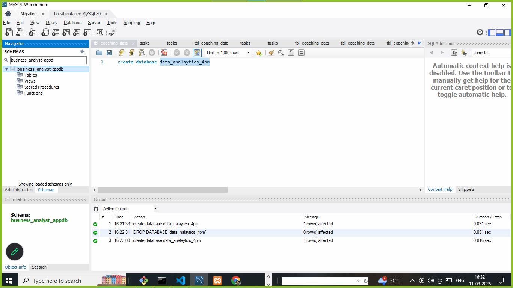
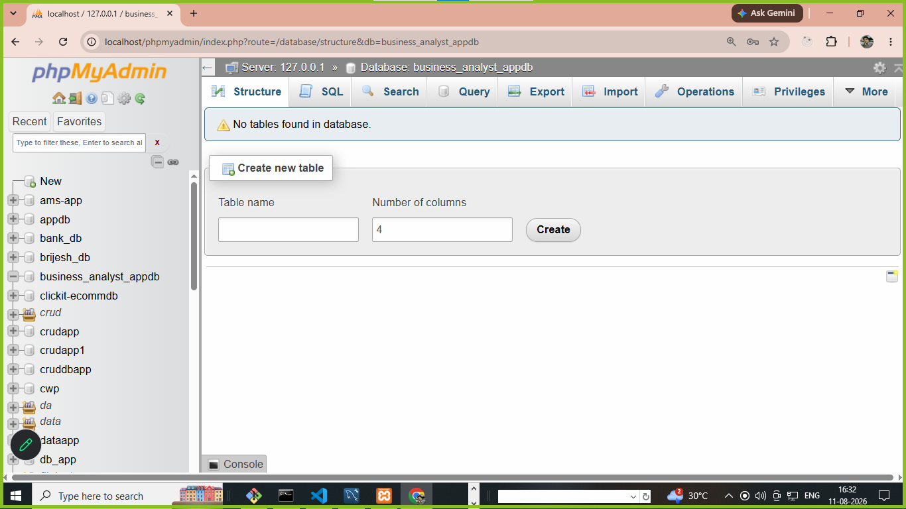

# what is SQL  ?

1. SQL stands for structured query language 
2. SQL is a case insenstive language 
3. SQL is not conditional 
4. SQL create a structured of database and tables 
5. SQL is execute query or command 

# what is query or command in SQL ?

1. query is a single line 
2. query and command both are same 
3. via SQL query its create and database and tables structured 

# types of SQL query ?

- THere are 4 types of SQL query 

- **DDL** (data definition language)

- **DML** (data manipulation language)

- **DQL** (data query language)

- **TCL** (transactional control language)


- **DDL** (data definition language) : 

1. DDL create an structured 
2. DDL create an database and tables structured 
3. DDL used to change column name is table
4. DDL used to change table name is table
5. DDL used to drop database and table structured


**DDL query are ..**

1. create 
2. alter 
3. truncate 
4. drop 
5. rename 
6. change 


## how to create database ? 

**syntax**

``` 
create database databasename;
or 
create database data_analytics_4pm;

```



or 

   

## how to create table in database  ? 

## chart of create table for its columnname or fieldname 

|   column name    |   data types     |    size           |
|------------------|------------------|-------------------|
|id                | int              | default size(11)  |
|name, email ,pass | char , varchar   | (0-255)           |
|mobile            | int, bigInt      | default size(20)  |
|decimal, salary   | decimal(10,2)    | (10,2)            |       
|address , message | text             | 65365 character   | 
|date , datetime   | date , datetime  |                   | 
|photo , image     | varchar , blob   |                   |
|salary            | float            |                   |
|multiple choice   | enum()           |                   |
|default timezone  | timestamp        |                   |
|true, false       | boolean          |                   |   


**syntax**

```
create table tablename
(
columnname datatype(size) primary key auto_increment,
.
.
.
.
.
column datatype(size)

)

or

create table customers(
id int AUTO_INCREMENT primary key,
name varchar(200),
password varchar(255),
firstname varchar(255),
lastname varchar(255),
gender varchar(255),
mobile bigint
)


or

create table tbl_feedback(
id int AUTO_INCREMENT primary key,
name varchar(100),
email varchar(255),
phone bigint,
rating enum('*','**','***','****','*****'),
comment text    
);

```

# alter ....

1. alter is used to add | update | modify new column in tables 
2. alter is also  used to add unique key of any column name 

**query or commands are**

```
alter table tbl_feedback add added_date_time datetime;
or
alter table customers add address text;
or
alter table customers add photo varchar(255) after name;
or
alter table tbl_feedback change added_date_time adddatetime datetime;

```

# add unique key via alter 

1. unique key is provides in table stored unique values 
2. unique is never stored dublicate values 


**add unique key via SQL**


```
alter table tbl_feedback add UNIQUE(`email`)

```

# change 

- change is used with alter 
- change is used to update any column name used with alter 

```
alter table tbl_feedback change adddatetime added_date datetime;
```


# rename :

- rename any table name 
- rename is use to update or rename to created tables 

```
rename table customers to tbl_customers;
```

# drop : 

**drop a database**

1. drop will used to delete database and its structured 
2. after drop we will never rollback any structured and data 

**syntax**

```
drop database databasename;
or
drop database data_analytics_4pm;

```

**drop a table**

1. drop will used to delete table and its data also 
2. after drop we will never rollback any structured or  data of tables

**syntax**

```
drop table tablename;
or
drop table tbl_customers;
or
drop table tbl_feedback;

```


# truncate : 

1. truncate is used to empty tables data 
2. truncate removed all data from tables 
3. truncate never rollback data 
4. truncate only delete data not delete structures 


**difference b/ primary key and unique key**

**primary key**
1. A pk is provides one times in table 
2. A pk key should always auto_increment
3. A pk never return a null values
4. A pk stored a unique values 

|   id(pk)     |  name     |  age  |   address |
|--------------|-------------------|-----------|
|   1          | brijesh   | 36    | rjt       |

**unique key**
1. A uk is provides more than one times in table 
3. A uk return one times a null values
4. A uk never return dublicate data 


|   id(pk)     |  name     |  age  |   address |  mobile   |    email   |
|--------------|-------------------|-----------|-----------|------------|
|   1          | brijesh   | 36    | rjt       |9121212    | a@gmail.com|


```
truncate table tablename
or
truncate table tbl_feedback 

``` 

# difference b/w truncate | drop | delete 

**truncate**

1. truncate is empty all data from tables 
2. after truncate we never rollback any data data from tables 
3. truncate deleted  only rows or data 


**drop**
1. drop is used to drop database or table with structured and data 
2. drop never rollback any data 

**drop database**

````
drop database data_analytics_430;
````

**drop  table**

````
drop table tbl_feedback;
````

**delete**

1. delete is used to delete all data from table
2. delete is used to delete particular data from tables 
3. delete is used to a range of data from tables 
4. delete is used to delete alternate   data from table

**delete data**

1. delete from tbl_country;
2. delete from tbl_country where cid=2;
3. delete from tbl_country where name='pakistan';
4. delete from tbl_country where cid between 6 and 50;
5. delete from tbl_country where cid in (2,5,7);

**note: after delete we rollback data using transanctional query**


# DML (data manipulation language)

1. DML is used to insert | delete | update data 

```
examples : insert | delete | update 

```

2. How to **insert data** ...

**syntax**

```
insert into tbl_customers(name,photo,password,firstname,lastname,gender,mobile,address) values('brijesh','brijesh.jpg','brij123','brij','pandey','male',912236151546,'rajkot')

or

insert into tbl_customers(name,photo,password,firstname,lastname,gender,mobile,address) values('dhruv','dhruv.jpg','d123','shruv','patel','male',912236151546,'rajkot'),('bhavika','bhavika.jpg','bh123','bhavika','sharma','female',9122361,'rajkot'),('kalpit','kalpit.jpg','kalpit','kalpit','patel','male',912236,'rajkot')

or

insert into tbl_customers values(null,'om','om.jpg','d123','shruv','patel','male',912236151546,'rajkot'),(null,'jainish','jainish.jpg','bh123','bhavika','sharma','female',9122361,'rajkot'),(null,'kumar','kumar.jpg','kalpit','kalpit','patel','male',912236,'rajkot')

```

3. How to **update data or rows**... 

**syntax**
```
update tablename set columnname='values' where id=1;
or 
update  tbl_customers set name='naimish',photo='naimish.png',password='naimish123',firstname='naimish',lastname='vaja',mobile=6356421656,address='150 feet ring road ahemdabad' where id=7; 
```


4. how to **delete data or **rows**..

- delete from tbl_country;
- delete from tbl_country where cid=2;
- delete from tbl_country where name='pakistan';
- delete from tbl_country where cid between 6 and 50;
- delete from tbl_country where cid in (2,5,7);

**note**
- after delete we can rollback data via rollback transactional query 


## DQL  : stands for data query language

**query in DQL**

```
select 

```