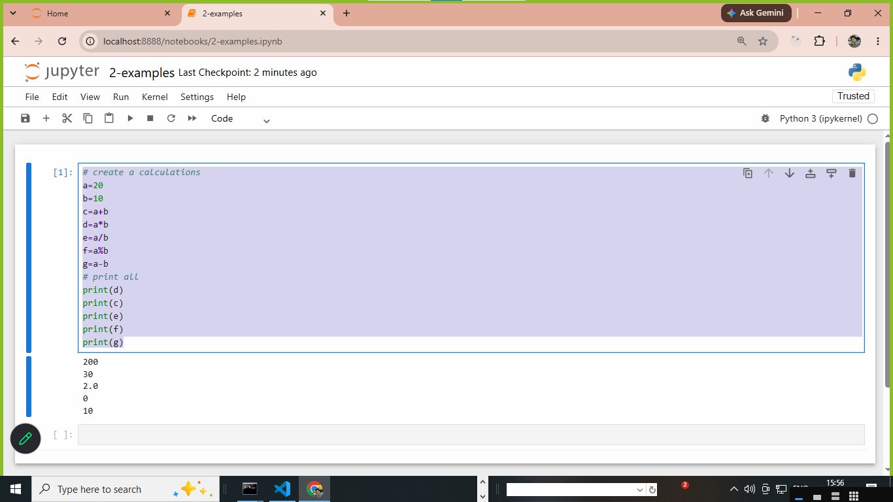
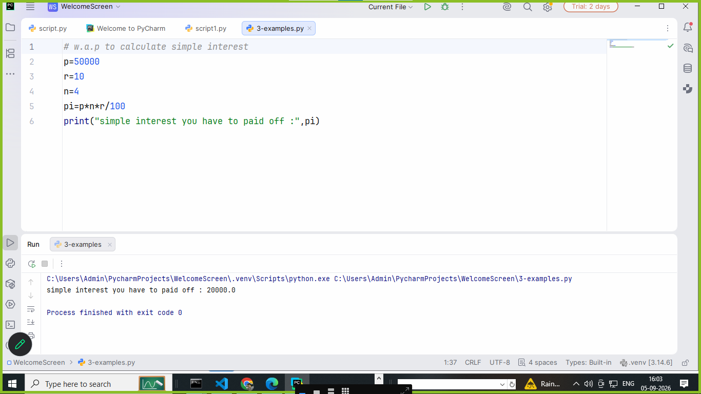

# what is python ? 
1. python is a high level language
2. python is also high level interpreted based programming language
3. python provides simple syntax 
4. it will be created by Guido van rossum by first released 1991 

## definition ..

```
python is a high-level interpreted , object oriented programming language used to developed software | websites | automation | data analytics | artificial intelligence systems and many more types of programmes there we used python.

```
# what is interpreter and compiler ? 
1. interpreter is used to execute and check step by step programmes and convert high level language to low level language.

2. compiler is used to execute and check step by step programmes and convert high level language to low level language.


## advantages of python 

1. **easy to learn** : easy and simple language
2. **free or open source** : free download and used
3. **python is support cross plateform**  : support all OS 
4. **large and many more packages and libraries support**: python are support many more languages and lib and packages 
5. **huge numbers of lib and framework support**
6. **support multiple programming style**
7. **automatic memory manage**
8. **rapid and fast development**
9. **create many programming software and website and automation app**
10. **large community**

## where we used python ? 
1. python used in Web development
   **django**
2. python used in software development
   **tkinter**
3. Artificial intelligence 
4. Data science 
5. data analytics 
6. Game development 
7. cyber securities 
8. Networking 
9. web scraping 
10. computer vision
11. DevOps
12. Robotics 
13. Automation


# how to run and install python ? 
  ```
  https://www.python.org/downloads/

  There are two method to run python 
  1) script method 
  2) REPL (read | evaluate | print | loop) method 
  
  ```

# script method : 
1. create a file an save it with .py 
2. and run via interpreter 

```
name='hi i am brijesh'
print(name)

```
# REPL or read evaluate print and loop
1. open cmd 
2. write py and enter
```
Type "help", "copyright", "credits" or "license" for more information.
>>> name="brijesh kumar pandey"
>>> print(name)
brijesh kumar pandey
>>> a=10
>>> b=20
>>> c=a+b
>>> print(c)
30
>>>
```

# how to install jupyter and run python programmes on jupyter ?

1. jupyter is a tools or IDE 
2. install jupyter 
3. pip install jupyter 
4. jupyter notebook

```
E:\data_analytics4pm-TTS\module-3-Python\core-python>pip show jupyter
Name: jupyter
Version: 1.1.1
Summary: Jupyter metapackage. Install all the Jupyter components in one go.
Home-page: https://jupyter.org
Author: Jupyter Development Team
Author-email: jupyter@googlegroups.org
License: BSD
Location: C:\Users\Admin\AppData\Roaming\Python\Python314\site-packages
Requires: ipykernel, ipywidgets, jupyter-console, jupyterlab, nbconvert, notebook
Required-by:

or

create a file in jupyter via 2-examples.ipynb

# create a calculations 
a=20
b=10
c=a+b
d=a*b
e=a/b
f=a%b
g=a-b
# print all
print(d)
print(c)
print(e)
print(f)
print(g)

```



## how to run python using pycharm 
1. pycharm is simple IDE specially built for python 
2. pycharm also created file in .ipynb and .py 
3. pycharm create a inbuilt projects of python or .VENV or virtual environment



