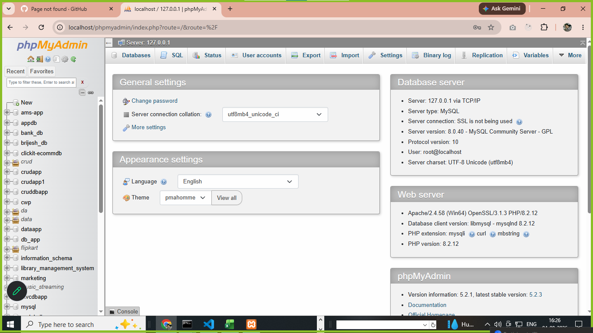
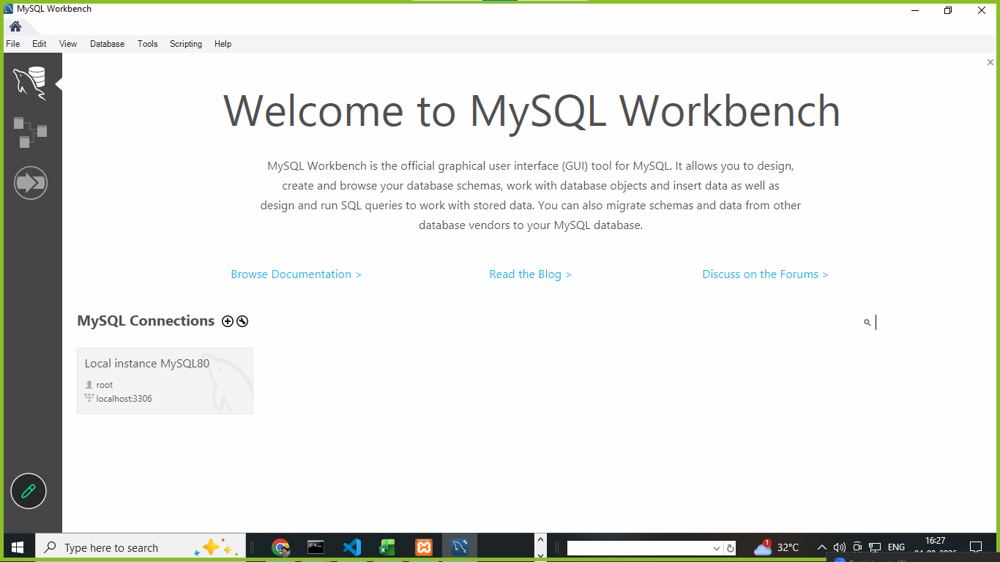
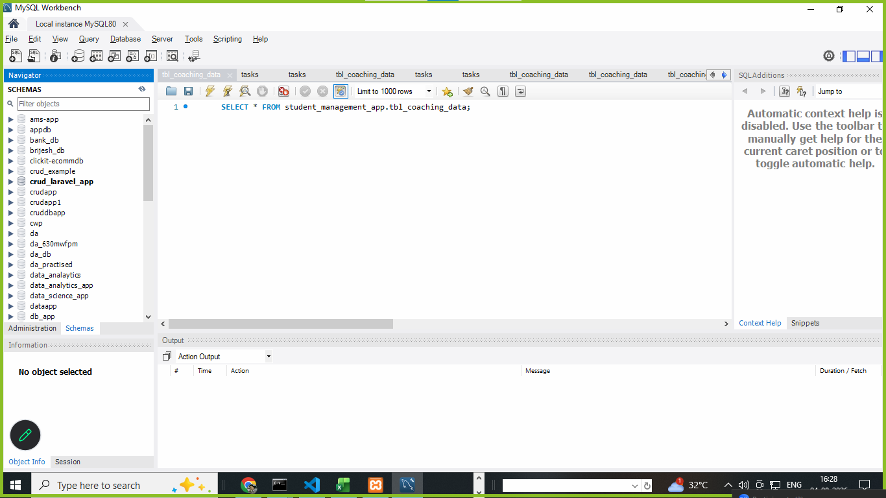
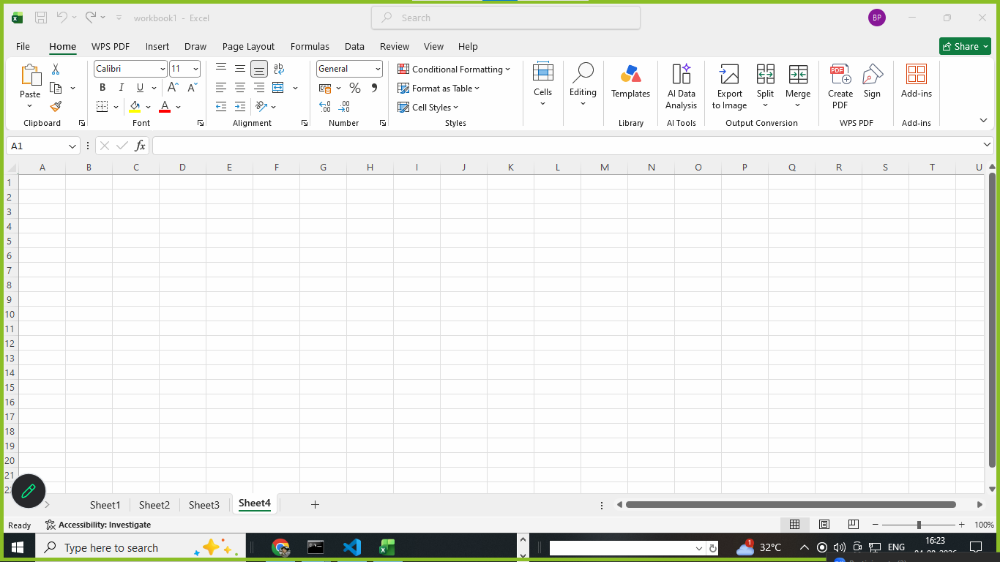
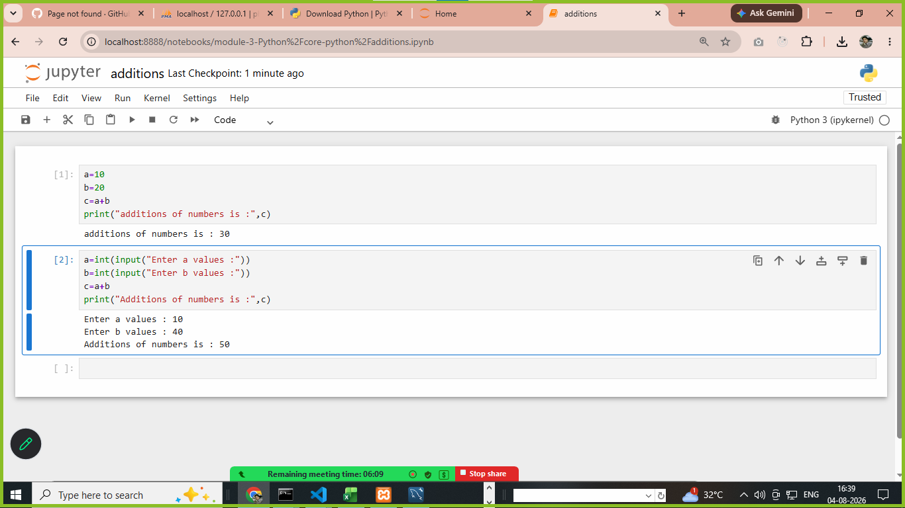
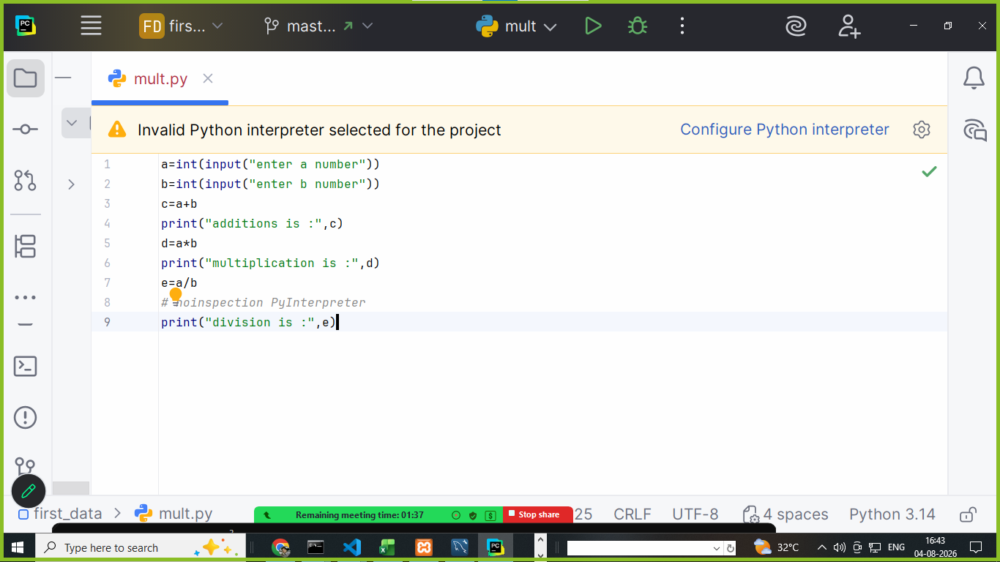

# download and install visual studio code 

```
https://code.visualstudio.com/

```

# download xampp and install 

```
https://www.apachefriends.org/download_success.html
```
**preview**




# download mysqlWorkbench8.0 and install 

```
https://dev.mysql.com/downloads/

```

**preview**


**open**




# excel verify 




# download python and install it 

**download python**

```
https://www.python.org/downloads/

```  

**check python install or not**

``` 
step : 1 

E:\data_analytics4pm-TTS>python
Python 3.14.6 (tags/v3.14.6:c63aec6, Jun 10 2026, 10:26:10) [MSC v.1944 64 bit (AMD64)] on win32
Type "help", "copyright", "credits" or "license" for more information.
>>>

```

# download python  jupyter notebook

1. python should be installed 
2. pip install notebook
3. jupyter notebook




# download pycharm for python 

```
https://www.jetbrains.com/pycharm/download/

```

**previews**


